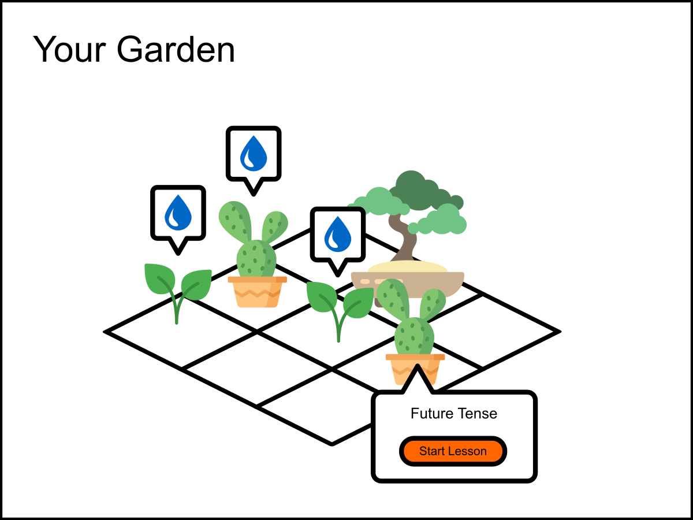
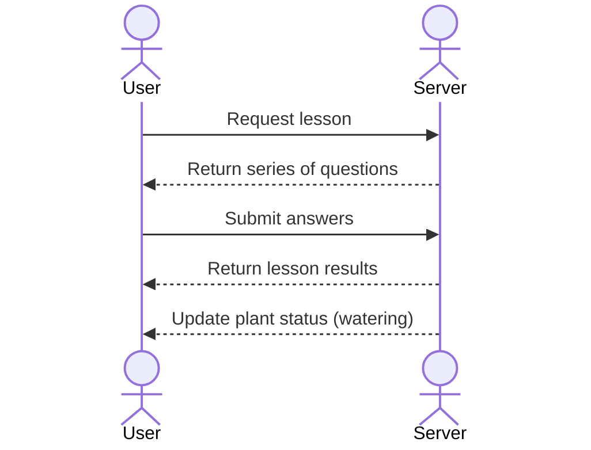

# Your startup name here

[My Notes](notes.md)

GrowLang, where you grow your language skills by growing a cute little garden! Learn a language by growing plants representing various grammar topics. By practicing your skills in an area, you water and grow the plant associated with that topic. Plants will dehydrate over time, so you need to review the matieral every so often to keep them fresh and watered. 

## 🚀 Specification Deliverable

> [!NOTE]
>  Fill in this sections as the submission artifact for this deliverable. You can refer to this [example](https://github.com/webprogramming260/startup-example/blob/main/README.md) for inspiration.

For this deliverable I did the following. I checked the box `[x]` and added a description for things I completed.

- [x] Proper use of Markdown
- [x] A concise and compelling elevator pitch
- [x] Description of key features
- [x] Description of how you will use each technology
- [x] One or more rough sketches of your application. Images must be embedded in this file using Markdown image references.

### Elevator pitch

Have you ever wanted to learn a new language, but struggle to see any growth when you study? Try GrowLang, where by taking language lessons, you cultivate your own garden! As you develop your lovely plants, you also develop your language skills! As you learn more topics, you get to collect many kinds of plants. Just remember to water them regularly by taking time to review what you have learned! 

### Design
Login screen:

Garden screen:

Lesson screen:

Here is a sequence diagram for completing a lesson/watering a plant:

### Key features

- Secure login over HTTPS
- Ability to display garden of plants
- Ability to select and water plants by taking a language lesson corresponding to certain topics
- Ability to gain new plants by learning new topics
- Ability to display, answer, and submit various practice questions
- Ability to persistently store state of the plants
- Ability to persistently store learning progress

### Technologies

I am going to use the required technologies in the following ways.

- **HTML** - Uses correct HTML structure for application. Three HTML pages. One for login, one for viewing garden, and one for language lessons.
- **CSS** - Application styling that looks good on different screen sizes, uses good whitespace, color choice and contrast.
- **React** - Provides login, garden display, displaying questions, submitting answers, showing results, and use of React for routing and components.
- **Service** - Backend service with endpoints for:
 - login
 - retrieving garden status
 - submitting answers to questions
 - retrieving lesson results
- **DB/Login** - Store users and their gardens in database. Register and login users. Credentials securely stored in database. Can't take lessons unless authenticated.
- **WebSocket** - As time passes, plants can change their status as they dehydrate. These changes in status are sent to the user

## 🚀 AWS deliverable

For this deliverable I did the following. I checked the box `[x]` and added a description for things I completed.

- [x] **Server deployed and accessible with custom domain name** - [My server link](https://yourdomainnamehere.click).

## 🚀 HTML deliverable

For this deliverable I did the following. I checked the box `[x]` and added a description for things I completed.

- [x] **HTML pages** - I created 4 pages for each view: `index.html` (login), `garden.html`, `quiz.html`, and `about.html`
- [x] **Proper HTML element usage** - I used various html elements such as header, footer, main, nav, form, button, div, and img
- [x] **Links** - There are links in the header to each other page. There is a link to GitHub in the footer
- [x] **Text** - There is text where necessary, especially in the about page
- [ ] **3rd party API placeholder** - What do I do here??? I can't find 3rd-party APIs mentioned anywhere except in the requirements!
- [x] **Images** - Images of what the application will look like are found in the about page
- [x] **Login placeholder** - Login placeholder on the login page (`index.html`)
- [x] **DB data placeholder** - The tiles on the garden page show which plants have been unlocked by the user.
- [x] **WebSocket placeholder** - The tiles on the garden page also show the state of the plants, which dehydrate over time

## 🚀 CSS deliverable

For this deliverable I did the following. I checked the box `[x]` and added a description for things I completed.

- [ ] **Header, footer, and main content body** - I did not complete this part of the deliverable.
- [ ] **Navigation elements** - I did not complete this part of the deliverable.
- [ ] **Responsive to window resizing** - I did not complete this part of the deliverable.
- [ ] **Application elements** - I did not complete this part of the deliverable.
- [ ] **Application text content** - I did not complete this part of the deliverable.
- [ ] **Application images** - I did not complete this part of the deliverable.

## 🚀 React part 1: Routing deliverable

For this deliverable I did the following. I checked the box `[x]` and added a description for things I completed.

- [ ] **Bundled using Vite** - I did not complete this part of the deliverable.
- [ ] **Components** - I did not complete this part of the deliverable.
- [ ] **Router** - I did not complete this part of the deliverable.

## 🚀 React part 2: Reactivity deliverable

For this deliverable I did the following. I checked the box `[x]` and added a description for things I completed.

- [ ] **All functionality implemented or mocked out** - I did not complete this part of the deliverable.
- [ ] **Hooks** - I did not complete this part of the deliverable.

## 🚀 Service deliverable

For this deliverable I did the following. I checked the box `[x]` and added a description for things I completed.

- [ ] **Node.js/Express HTTP service** - I did not complete this part of the deliverable.
- [ ] **Static middleware for frontend** - I did not complete this part of the deliverable.
- [ ] **Calls to third party endpoints** - I did not complete this part of the deliverable.
- [ ] **Backend service endpoints** - I did not complete this part of the deliverable.
- [ ] **Frontend calls service endpoints** - I did not complete this part of the deliverable.
- [ ] **Supports registration, login, logout, and restricted endpoint** - I did not complete this part of the deliverable.

## 🚀 DB deliverable

For this deliverable I did the following. I checked the box `[x]` and added a description for things I completed.

- [ ] **Stores data in MongoDB** - I did not complete this part of the deliverable.
- [ ] **Stores credentials in MongoDB** - I did not complete this part of the deliverable.

## 🚀 WebSocket deliverable

For this deliverable I did the following. I checked the box `[x]` and added a description for things I completed.

- [ ] **Backend listens for WebSocket connection** - I did not complete this part of the deliverable.
- [ ] **Frontend makes WebSocket connection** - I did not complete this part of the deliverable.
- [ ] **Data sent over WebSocket connection** - I did not complete this part of the deliverable.
- [ ] **WebSocket data displayed** - I did not complete this part of the deliverable.
- [ ] **Application is fully functional** - I did not complete this part of the deliverable.
